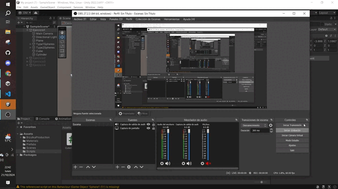
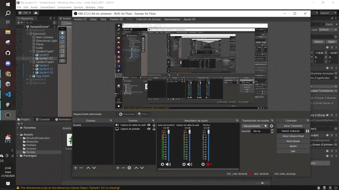
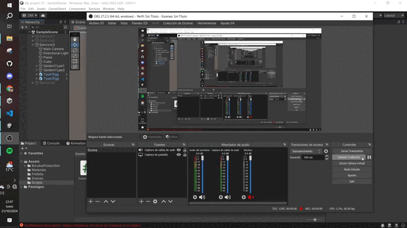
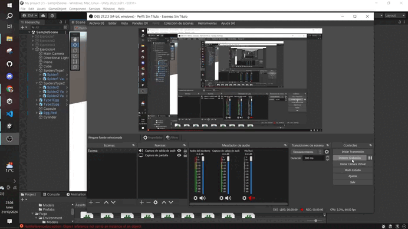
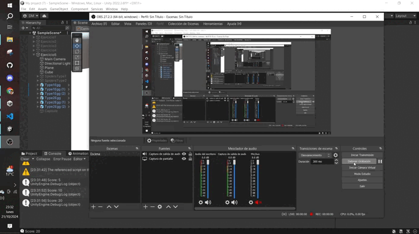
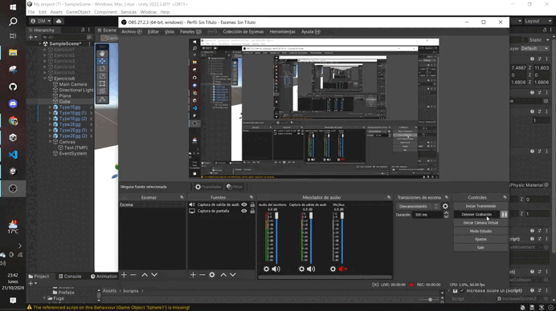
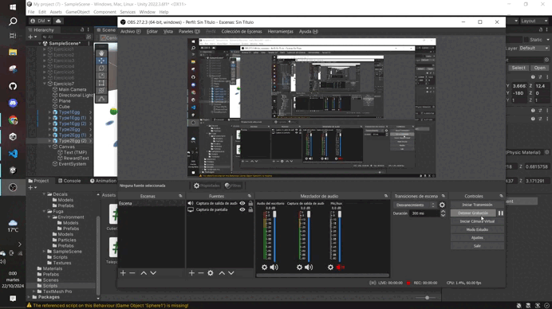
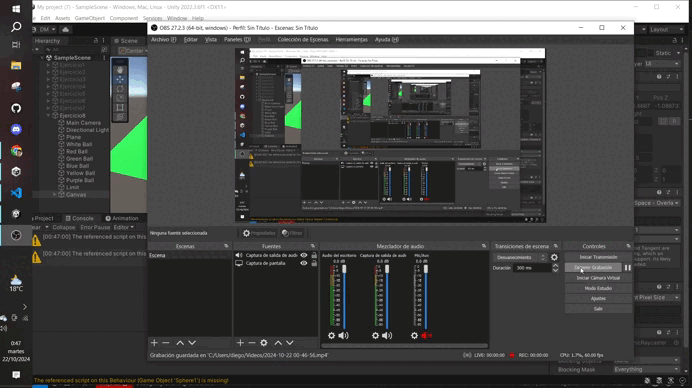

# Interfaces Inteligentes  
## Práctica 04. Delegados y Eventos  
**Diego Rodríguez Martín**  
**alu0101464992@ull.edu.es**

### Ejercicio 1  
El cubo actúa como notificador en la escena, por lo que cuando detecta colisión con el cilindro, envía el mensaje. A su vez, los scripts asociados a las esferas están suscritos a ese mensaje, por lo que cuando se activa, las esferas de tipo 1 se dirigen hacia una de las esferas de tipo 2 que fijes de antemano y las esferas de tipo 2 se desplazan hacia el cilindro.

### Ejercicio 2  
Idem al Ejercicio 1, pero con el asset de arañas.

### Ejercicio 3  
Aquí, el cubo sigue siendo el notificador. Por otro lado, las arañas de tipo 1 están suscritas al evento de "chocar el cubo con araña de tipo 2" y "chocar el cubo con araña de tipo 1". En el primer caso, dichas arañas se dirigen hacia un objeto seleccionado. En el segundo caso, hacia los huevos del grupo 2.

### Ejercicio 4  
Notificador -> cubo. Cuando se acerca al cilindro (se ha hecho el collider más grande para que detecte la colisión cuando se "aproxima"), se teletransportan las arañas al huevo seleccionado y las de otro tipo se giran hacia otro objeto.

### Ejercicio 5  
Aunque en este ejercicio podría haberme ahorrado el uso de eventos, ya que en el propio `OnCollision` del cubo podía haberlo resuelto, he implementado delegados y eventos. De manera que el cubo notifica cuando choca con un huevo de tipo 1 y tipo 2. Dicha notificación es recibida por el script `IncreaseScore`, que así mismo se aloja en el cubo e incrementa la puntuación.

### Ejercicio 6  
Idem a la anterior pero con UI. Se crea un Canvas con un `TextMeshPro` dentro, donde se refleja la puntuación. En un script `IncreaseScoreUI` se recoge el texto como objeto público (arrastrando) y se modifica cuando cambia la puntuación.

### Ejercicio 7  
Como en el anterior, creamos otro texto para la recompensa, en este caso un aumento de velocidad (funcional).

### Ejercicio 8  
Para culminar la práctica, he decidido crear un prototipo muy básico de billar. En este, la bola blanca se dispara pulsando la tecla "espacio", pudiendo apuntar gracias a un `Debug.DrawRay()` en el `Update()`. Cuando colisiona con otro objeto con tag "Ball", a este se le aplica una fuerza a su `Rigidbody`, simulando el golpe de la bola blanca. Además, cuando la bola cae fuera del tablero, hay un objeto invisible con un collider que, cuando hace contacto con una bola, la destruye y aumenta la puntuación en la UI por medio de eventos como en los ejercicios anteriores.

